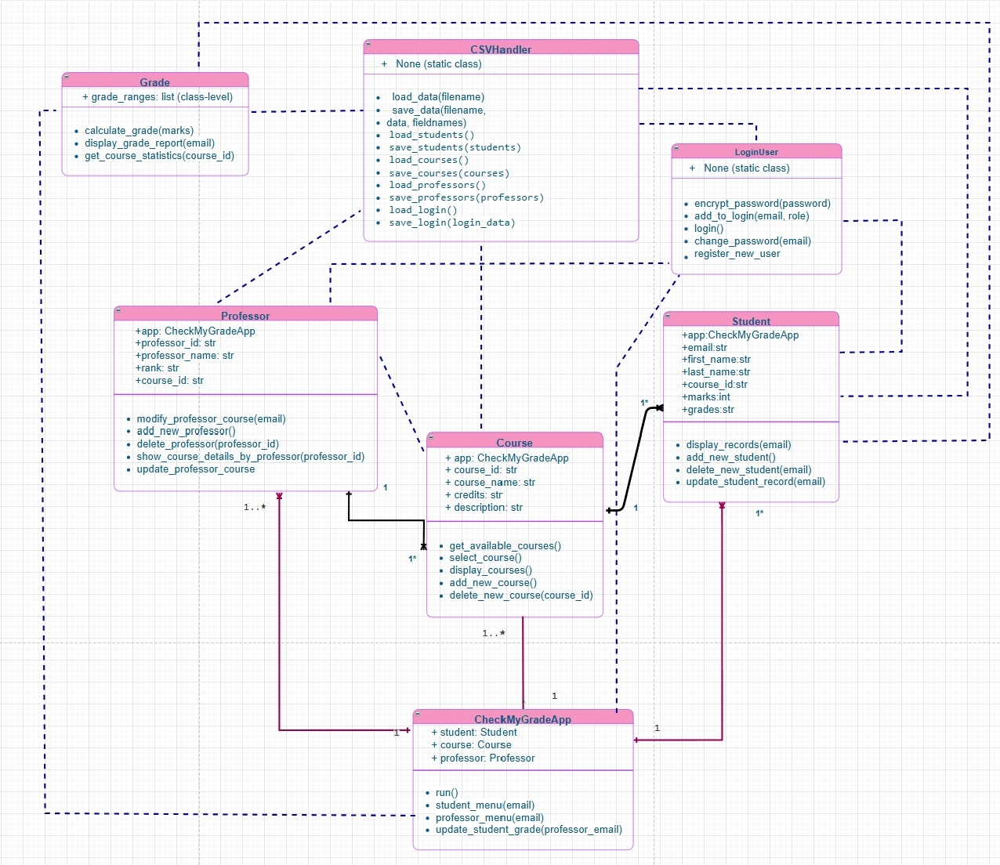

# CheckMyGradeApp
This app is an intuitive, onsole-based Python application designed to manage and track student academic performance efficiently. Leveraging object-oriented programming principles, it enables professors and students to interact seamlessly with course information and academic records.

